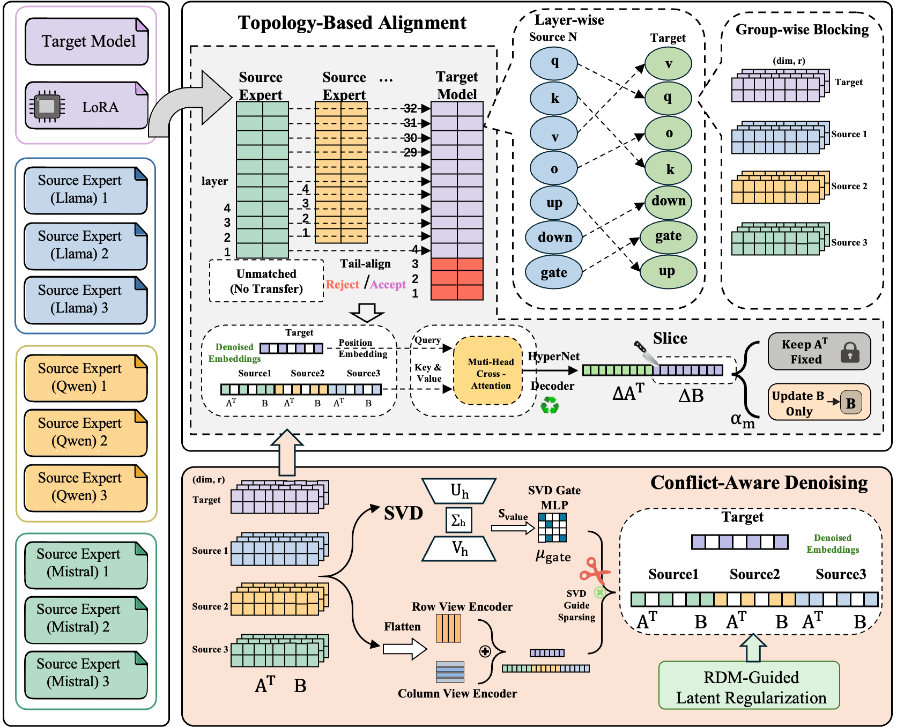
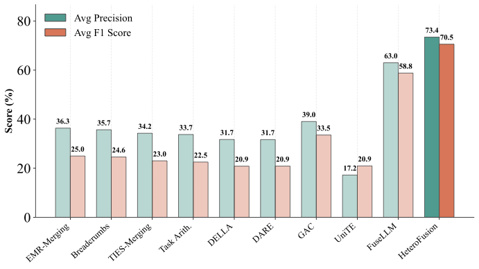
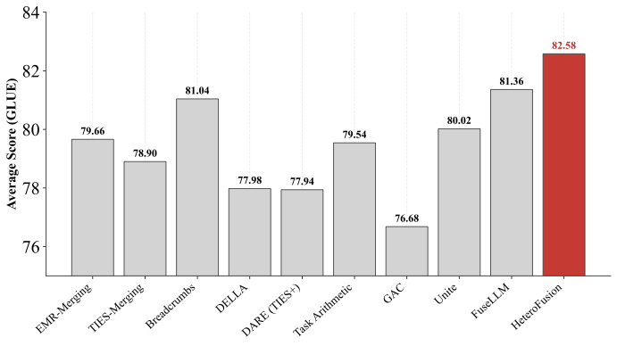
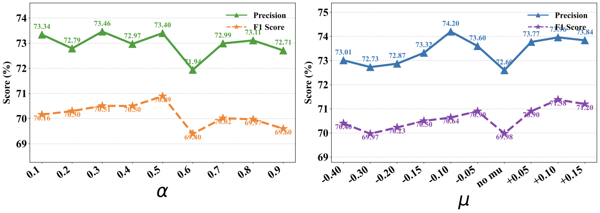

# HeteroFusion

**Can Heterogeneous Language Models Be Fused?**

HeteroFusion is an adapter-space fusion framework for transferring and consolidating task knowledge across heterogeneous language model families such as Llama, Qwen, and Mistral. Instead of assuming a shared backbone or directly averaging incompatible weights, HeteroFusion aligns source and target adapters by functional topology, filters conflicting transfer signals, and predicts structured updates for the target adapter.

<p align="center">
  
</p>

## Overview

Most model merging methods work only when all experts come from the same pretrained family. HeteroFusion targets the more realistic setting where useful experts are heterogeneous.

HeteroFusion has three core ideas:

- **Topology-Based Alignment** maps compatible modules across heterogeneous backbones instead of relying on raw tensor-coordinate matching.
- **Conflict-Aware Denoising** uses SVD-guided sparse gating and distribution regularization to suppress noisy or contradictory source signals.
- **Target-Basis Preservation** keeps the target LoRA `A` matrices fixed and only predicts structured updates for the target `B` matrices, making transfer more stable and controllable.

The training loop dynamically patches predicted LoRA updates into the target adapter, optimizes them on a lightweight mixed replay set, and exports a single fused adapter at the end.

## What This Repository Contains

- The HeteroFusion training pipeline in [`main.py`](main.py) and [`src/`](src)
- Paper experiment configs in [`configs/heterofusion/paper_experiments/`](configs/heterofusion/paper_experiments)
- Lightweight sample replay data in [`data/sample/`](data/sample)
- Experiment runner scripts for the main paper settings
- Paper figures adapted for GitHub rendering in [`assets/`](assets)

## Repository Layout

```text
HeteroFusion/
├── assets/                               # Figures used in the README
├── configs/heterofusion/paper_experiments/
│   ├── single_source_qwen_to_llama/      # Main UIE transfer setting
│   ├── multi_source_cross_family/        # Multi-source heterogeneous fusion
│   ├── noise_robustness/                 # Noisy-source robustness
│   ├── glue_cross_family/                # Cross-family GLUE evaluation
│   ├── sensitivity_alpha/               # Alpha sweeps
│   └── sensitivity_mu_gate/             # mu_gate sweeps
├── data/sample/                          # 300-example replay subsets
├── llamafactory/                         # Local code dependency used for data/model utilities
├── src/
│   ├── model.py                          # Transfer network and denoising blocks
│   ├── trainer.py                        # Dynamic patching + fusion optimization
│   └── losses.py                         # RDM regularization
├── main.py                               # Pipeline entry point
├── run_paper_single_source_qwen_to_llama.sh
├── run_paper_glue_cross_family.sh
├── run_paper_hyperparameter_sweep.sh
└── docs/
```

## Setup

The current release is organized as a research codebase rather than a packaged library. A minimal environment that matches the top-level imports is:

```bash
conda create -n heterofusion python=3.10 -y
conda activate heterofusion
pip install --upgrade pip
pip install torch torchvision torchaudio
pip install transformers peft safetensors pyyaml fire tqdm numpy datasets accelerate sentencepiece scipy einops
```

This repository also vendors local utilities from `llamafactory/`. If your environment differs from the one used in the paper, you may need a few extra upstream Llama-Factory dependencies depending on your tokenizer, model family, or dataset pipeline.

## Required Paths

Configs use environment variables so the same YAML files can be reused across machines:

```bash
export MODEL_ROOT=/path/to/base_models
export ADAPTER_ROOT=/path/to/lora_experts
```

Each adapter directory is expected to contain:

- `adapter_config.json`
- `adapter_model.safetensors` or `adapter_model.bin`

## Data

The repository includes lightweight sample replay sets under [`data/sample/`](data/sample). These are the 300-example subsets referenced in the paper for replay-based fusion experiments.

The following assets are **not** bundled in this repository:

- full pretrained base models
- all source and target LoRA experts
- full benchmark datasets

You should prepare these according to the corresponding model and dataset licenses before public release.

## Quick Start

Run one paper configuration directly:

```bash
python main.py --config_path configs/heterofusion/paper_experiments/single_source_qwen_to_llama/llama_target_mit_movie.yaml
```

Run the single-source paper sweep:

```bash
bash run_paper_single_source_qwen_to_llama.sh
```

Run the GLUE cross-family setting:

```bash
bash run_paper_glue_cross_family.sh
```

Run the alpha sweep:

```bash
bash run_paper_hyperparameter_sweep.sh
```

The shell runners support options such as `DRY_RUN=1`, `SKIP_FINISHED=1`, and GPU assignment controls. See the scripts for details.

## Paper Settings Covered by the Configs

- **Single-source heterogeneous transfer**:
  [`configs/heterofusion/paper_experiments/single_source_qwen_to_llama/`](configs/heterofusion/paper_experiments/single_source_qwen_to_llama)
- **Multi-source cross-family fusion**:
  [`configs/heterofusion/paper_experiments/multi_source_cross_family/`](configs/heterofusion/paper_experiments/multi_source_cross_family)
- **Noisy-source robustness**:
  [`configs/heterofusion/paper_experiments/noise_robustness/`](configs/heterofusion/paper_experiments/noise_robustness)
- **Cross-family GLUE transfer**:
  [`configs/heterofusion/paper_experiments/glue_cross_family/`](configs/heterofusion/paper_experiments/glue_cross_family)
- **Sensitivity studies**:
  [`configs/heterofusion/paper_experiments/sensitivity_alpha/`](configs/heterofusion/paper_experiments/sensitivity_alpha) and
  [`configs/heterofusion/paper_experiments/sensitivity_mu_gate/`](configs/heterofusion/paper_experiments/sensitivity_mu_gate)

More detailed reproduction notes are provided in [`docs/REPRODUCE.md`](docs/REPRODUCE.md).

## Main Results Snapshot

- **Single-source Qwen -> Llama transfer**: HeteroFusion reaches **71.38 average F1**, improving over Llama Merge (**67.60**) and FuseLLM (**63.15**).
- **Multi-source Qwen + Mistral -> Llama transfer**: HeteroFusion reaches **71.31 average F1**.
- **Noisy-source robustness**: HeteroFusion maintains **70.55 average F1** under task-irrelevant source experts.
- **GLUE cross-family transfer**: HeteroFusion reaches **82.58 average score**.

<p align="center">
  
  
</p>

<p align="center">
  
</p>

## Release Notes Before Public GitHub Launch

This repository now contains the open-source documentation skeleton, but a few project-specific fields should still be finalized before the public launch:

- replace placeholder citation metadata with the public author list and arXiv link
- choose and add a repository license
- verify redistribution permissions for vendored code, datasets, adapters, and sample data
- optionally separate the paper source tree from the code release tree

## Citation

Please update the metadata below before the public release if the paper record changes.

```bibtex
@article{heterofusion2026,
  title   = {Can Heterogeneous Language Models Be Fused?},
  author  = {To be updated},
  journal = {arXiv preprint},
  year    = {2026}
}
```

## Acknowledgements

- [Llama-Factory](https://github.com/hiyouga/LLaMA-Factory) for the training and data-processing foundation used to prepare experts
- Hugging Face Transformers and PEFT for model and adapter tooling
